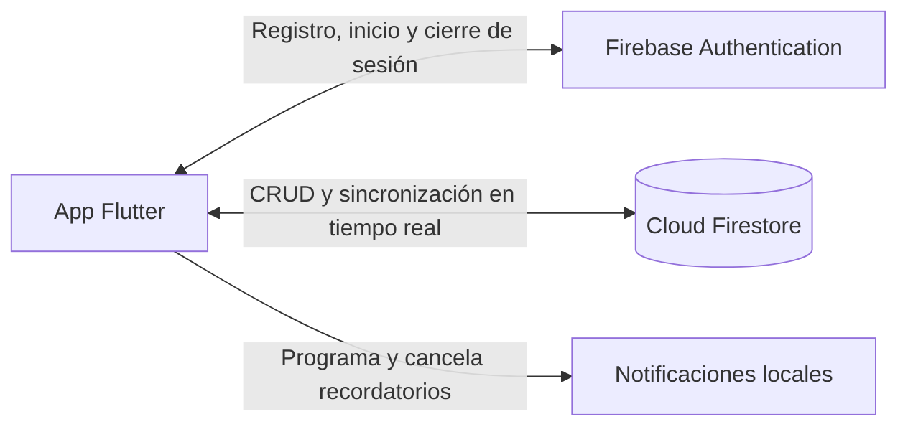

# Arquitectura

```mermaid
flowchart LR
    app["App Flutter"]
    auth["Firebase Authentication"]
    firestore[("Cloud Firestore")]
    notifications["Notificaciones locales"]

    app <-->|"Registro, inicio y cierre de sesión"| auth
    app <-->|"CRUD y sincronización en tiempo real"| firestore
    app -->|"Programa y cancela recordatorios"| notifications
```
