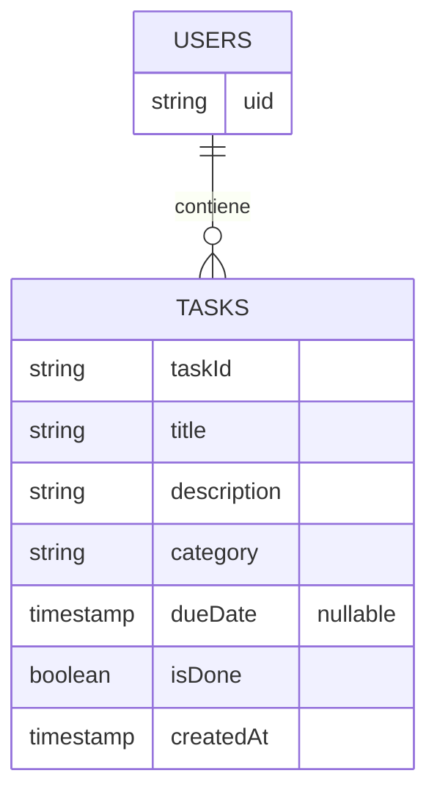

# Esquema de Cloud Firestore

```mermaid
erDiagram
    USERS ||--o{ TASKS : contiene
    USERS {
        string uid
    }
    TASKS {
        string taskId
        string title
        string description
        string category
        timestamp dueDate "nullable"
        boolean isDone
        timestamp createdAt
    }
```

Cada tarea se guarda en `users/{uid}/tasks/{taskId}` y solo el usuario
autenticado cuyo UID coincide con `{uid}` puede leerla o modificarla.
