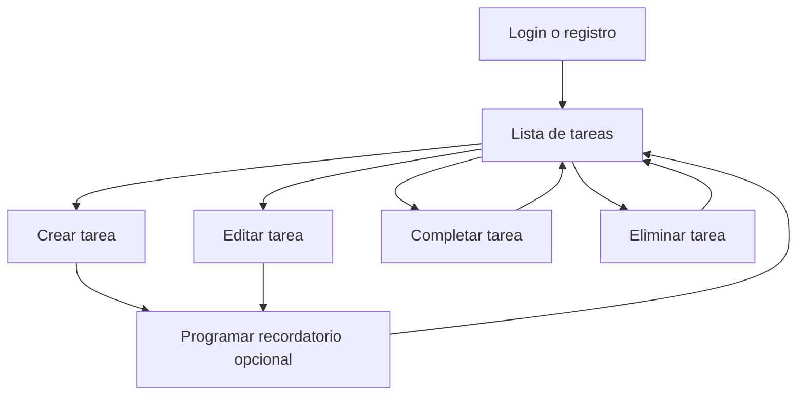

# Flujo de usuario

```mermaid
flowchart TD
    login["Login o registro"]
    list["Lista de tareas"]
    create["Crear tarea"]
    edit["Editar tarea"]
    reminder["Programar recordatorio opcional"]
    complete["Completar tarea"]
    delete["Eliminar tarea"]

    login --> list
    list --> create
    list --> edit
    create --> reminder
    edit --> reminder
    reminder --> list
    list --> complete
    complete --> list
    list --> delete
    delete --> list
```
