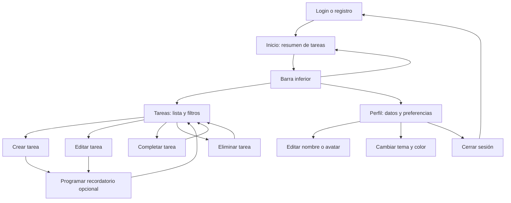

# Flujo de usuario

```mermaid
flowchart TD
    login["Login o registro"]
    home["Inicio: resumen de tareas"]
    nav["Barra inferior"]
    list["Tareas: lista y filtros"]
    profile["Perfil: datos y preferencias"]
    create["Crear tarea"]
    edit["Editar tarea"]
    reminder["Programar recordatorio opcional"]
    complete["Completar tarea"]
    delete["Eliminar tarea"]
    name["Editar nombre o avatar"]
    appearance["Cambiar tema y color"]
    logout["Cerrar sesión"]

    login --> home
    home --> nav
    nav --> home
    nav --> list
    nav --> profile
    list --> create
    list --> edit
    create --> reminder
    edit --> reminder
    reminder --> list
    list --> complete
    complete --> list
    list --> delete
    delete --> list
    profile --> name
    profile --> appearance
    profile --> logout
    logout --> login
```
